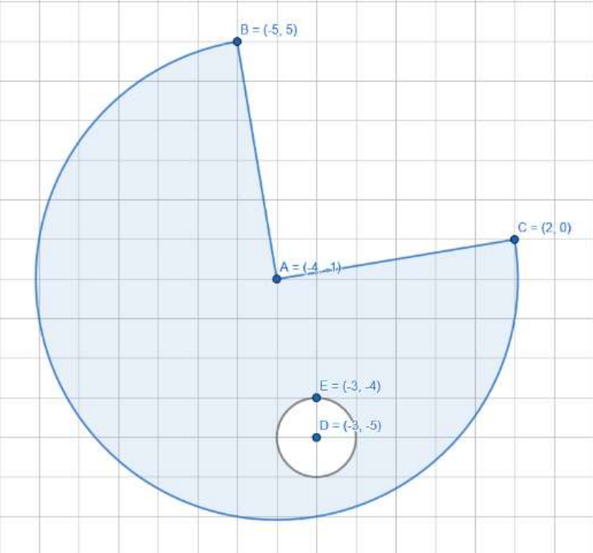

# Изрази и логически операции (продължение)

**Цел:** Не използвайте условни оператори (`if`, `switch`) или цикли (`for`, `while`). Решенията трябва да се изразяват само чрез аритметични и логически операции.

---

### Задача 1 → Абсолютна стойност чрез изрази

Изчислете абсолютната стойност на цяло число **без** помощта на функции от `<math.h>` и `<stdlib.h>`.

### Задача 2 → Класификация на символи

Прочетете символ от стандартния вход (клавиатурата) и проверете дали е главна/малка буква, цифра
или нещо друго.

```
Вход 1:
A

Изход 1:
1 0 0 0

Вход 2:
$

Изход 2:
0 0 0 1
```

### Задача 3 → Сечение на интервали

Дадени са цели числа `a`, `b`, `c` и `d`. Да се намери сечението на интервалите `[a, b]` и `[c, d]`, като се изведе `0`, ако нямат обща част, и `1`, ако имат. Ограничения: `-10^18 <= a, b, c, d <= 10^18`.

```
Вход 1:
2 8
-7 5

Изход 1:
2 5 1

Вход 2:
0 18
22 22

Изход 2:
22 18 0
```

### Задача 4 → Позиция на точка спрямо окръжност

Напишете програма, която по зададени окръжност и точка определя дали точката се намира вътре, върху или извън окръжността. На първия ред от стандартния вход се подават три цели числа `x0`, `y0`, `r` - координати на центъра и радиус на окръжността, а на втория - две цели числа с координатите на точката. На стандартния изход изведете три стойности (0/1), указващи дали точката е вътре, върху или извън окръжността.

```
Вход:
0 0 5
4 -3

Изход:
0 1 0
```

### Задача 5 → Сравнение с толеранс при числа с плаваща запетая

Същата като *Задача 4*, единствено с разликата, че въведените числа са с плаваща запетая. Помислете как бихте ги сравнявали.

> **Бележка:** Компютрите представят реалните числа в **двоична бройна система** (база 2). В нея могат да се изразят точно само дроби, които са **съставени от степени на 1/2** (например `0.5 = 1/2`, `0.25 = 1/4`, `0.75 = 1/2 + 1/4`). Но числа като `0.1` или `0.2` нямат крайно двоично представяне - в двоична форма те изглеждат така: `0.1₁₀ = 0.0001100110011...₂` (безкрайно повтаряща се дроб). Компютърът трябва да **закръгли** това число, което внася малка грешка. Когато правим изчисления (например `(x - x0)^2 + (y - y0)^2`), тези неточности се натрупват и резултатът може леко да се различава от очакваното - примерно `dist2 = 24.9999999997` вместо `25.0`. Затова при сравнение на `double` стойности не използваме `==`, а проверяваме дали са **достатъчно близки**, например: `fabs(dist2 - r2) <= 1e-9`.

### Задача 6 → Лице на триъгълник

Да се напише програмата, която по зададени цели числа `a`, `b` и `c` намира (и извежда) с точност до три знака след десетичната запетая лицето на триъгълник със страни с дължини `a`, `b` и `c`. Програмата да извежда `-1`, ако не съществува такъв триъгълник.

```
Вход 1:
3 4 5

Изход 1:
6.000

Вход 2:
1 2 3

Изход 2:
-1.000
```

### Задача 7 → Сечение на правоъгълници

В декартова координатна система са зададени два правоъгълника със страни, успоредни на координатните оси. Всеки правоъгълник се описва с четири цели числа - координатите на горния му ляв и долния му десен ъгъл. Напишете програма, която чете тези два правоъгълника и проверява дали имат поне една обща точка.

> **Бележка:** Можете да използвате подхода от *Задача 3* за сечение на интервали. Два правоъгълника (с успоредни на координатните оси страни) се пресичат, ако **техните хоризонтални и вертикални проекции се припокриват**. Ако единият правоъгълник е изцяло **вляво, вдясно, над или под** другия, те не се пресичат. Проверете дали интервалите по `x` и по `y` се пресичат, за да определите дали правоъгълниците имат поне една обща точка.

### Задача 8 → Площ на сечение на правоъгълници

За два правоъгълника, зададени по същия начин като в *Задача 7*, намерете площта на тяхното сечение.

### Задача 9 → Следваща секунда

Напишете програма, която въвежда време от денонощието във формата `HH:MM:SS` и извежда в същия формат времето, което е една секунда след въведеното.

```
Вход 1:
12:45:56

Изход 1:
12:45:57

Вход 2:
13:57:59

Изход 2:
13:58:00

Вход 3:
23:59:59

Изход 3:
00:00:00
```

### Задача 10 → Квадрант на точка

Напишете програма, която въвежда две числа с плаваща запетая - координатите на точка в двумерна декартова координатна система - и извежда в кой квадрант попада точката. Програмата да извежда числото `0`, ако точката е върху някоя от координатните оси.

### Задача 11 → Октант на точка

Напишете програма, която въвежда три числа с плаваща запетая - координатите на точка в тримерна декартова координатна система - и извежда в кой октант попада точката. Програмата да извежда числото `0`, ако точката е върху някоя от координатните оси.

### Задача 12 → Средно аритметично на четни числа

Напишете програма, която по въведени две цели числа `a` и `b` намира средното аритметично на всички **четни числа** в интервала `[a, b]`. Ако интервалът не съдържа четни числа, резултатът се приема за `0`. Ограничения: `-10^16 <= a, b <= 10^16`.

### Задача 13* → Проверка на точка в оцветена област (КР1, 2024-2025)

Напишете логически израз, който се оценява като истина, ако точка с координати `(x, y)` принадлежи на оцветената област, и като лъжа в противен случай.



### Задача 14* → Шахматни ходове (КР1, 2024-2025)

Напишете програма, която по две валидни точки от шахматна дъска проверява дали може да се достигне от първата до втората точка с един ход на топ, цар или царица.

---

### Полезни ресурси и допълнителни материали

- [Binary Fractions and Floating Point](https://ryanstutorials.net/binary-tutorial/binary-floating-point.php)
- [Demystifying Floating-Point Arithmetic](https://medium.com/@olivier.s/demystifying-floating-point-arithmetic-why-0-1-0-2-0-3-673b9c4bcf9a)
- [Floating Point Numbers](https://www.learncpp.com/cpp-tutorial/floating-point-numbers/)
- [Why Can't Decimal Numbers Be Represented Exactly in Binary?](https://stackoverflow.com/questions/1089018/why-cant-decimal-numbers-be-represented-exactly-in-binary)